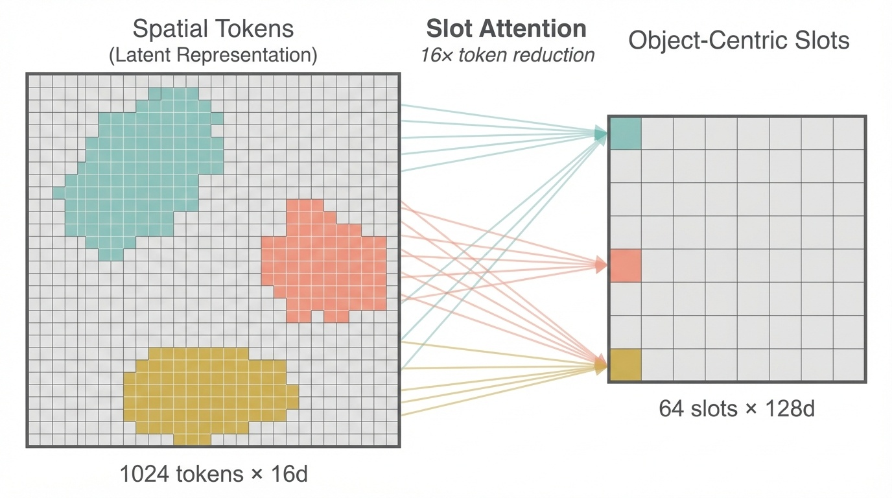
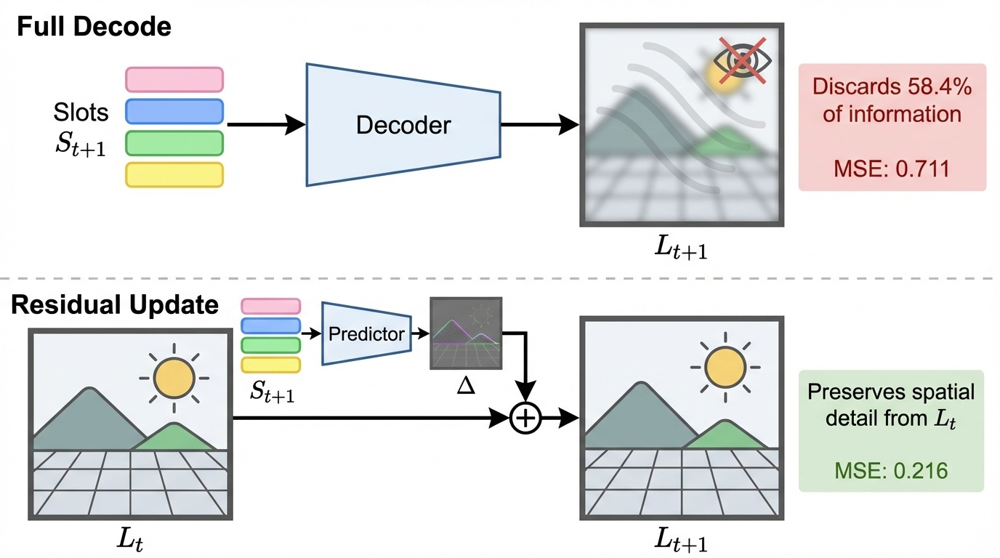
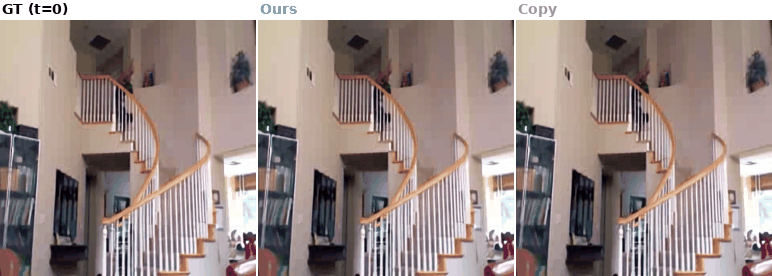
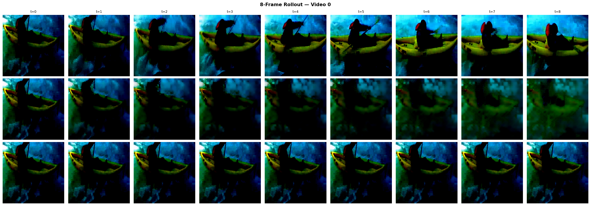
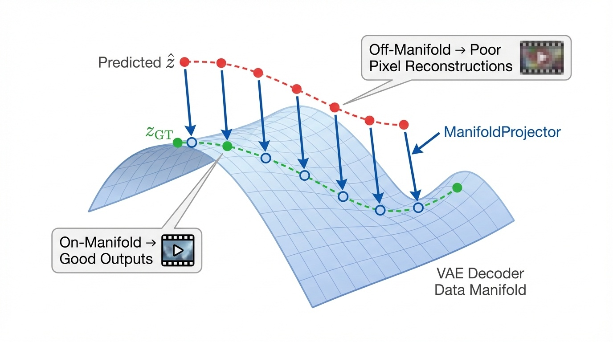

<p align="center">
  
</p>

<h1 align="center">NeuroCodec</h1>

<p align="center">
  <strong>Efficient Video Prediction via Residual Latent Dynamics</strong>
</p>

<p align="center">
  <a href="https://zenodo.org/records/18860333"></a>
  <a href="https://opensource.org/licenses/MIT"></a>
  <a href="https://pytorch.org/"></a>
</p>

<p align="center">
  <b>1.92M trainable params</b> &nbsp;|&nbsp; <b>2.67x rollout stability</b> &nbsp;|&nbsp; <b>FID 31.5 vs SimVP 84.8</b> &nbsp;|&nbsp; <b>first SSv2 video prediction benchmark</b>
</p>

---

NeuroCodec predicts future video frames as **residual updates** in a frozen video VAE latent space: `L_{t+1} = L_t + Delta`. Instead of generating each frame from scratch, we predict only what changes — motivated by predictive processing in biological vision.

## Architecture

<p align="center">
  
</p>

```
CogVideoX VAE Encoder → Latents [B, 16, T, 32, 32]
  → Slot Attention         → 64 slots × 128d  (16x compression)
  → Dynamics Transformer   → predict S_{t+1}   (438K params)
  → Boundary Detector      → EASY (85%) / HARD (15%)
  → Residual Decoder       → L_{t+1} = L_t + Delta  (1.43M params)
  → Manifold Projector     → correct off-manifold drift  (55K params)
  → CogVideoX VAE Decoder  → pixel frames
```

## Results

### UCF-101

| Metric | Ours | Copy Baseline | Improvement |
|--------|------|---------------|-------------|
| Latent MSE | **0.216** | 0.342 | **-36.8%** |
| LPIPS (single-step) | **0.105** | 0.097 | within 8% |
| SSIM (single-step) | **0.849** | 0.847 | +0.2% |
| Inference latency | **0.25 ms** | — | **130-406x faster** than UNet-50 |
| Rollout stability (8 frames) | **2.07x** | 1.83x | stable multi-step |

### Something-Something v2 (220K videos)

First published video prediction benchmark on SSv2. The architecture generalizes to 220K videos (2.65M frame pairs) **without any modification**:

**Single-step pixel quality** (100 videos, 300 frame pairs):

| Method | SSIM | PSNR | LPIPS |
|--------|------|------|-------|
| NeuroCodec (GT slots) | **0.718** | **23.77** | 0.197 |
| SimVP (2.08M params) | 0.708 | 22.58 | 0.355 |
| NeuroCodec (predicted) | 0.688 | 22.53 | **0.194** |
| Copy Baseline | 0.664 | 21.78 | 0.168 |

**Rollout stability** (50 videos, 13 frames):

| Method | Stability | FID | FVD |
|--------|-----------|-----|-----|
| NeuroCodec | **2.67x** | **31.5** | 68.4 |
| SimVP | 1.93x | 84.8 | **46.7** |
| Copy Baseline | 1.51x | 6.8* | 67.3 |

<sub>*Copy FID is trivially low because it reproduces real frames.</sub>

NeuroCodec achieves **77% better rollout stability** than Copy and **2.7x better FID** than SimVP, with only **1.92M trainable parameters** (6-190x smaller than comparable methods).

### Ablation

| Configuration | MSE | vs. Full System |
|---------------|-----|-----------------|
| Full System | 0.219 | — |
| w/o Residual | 0.711 | +225% |
| w/o Slots | 0.211 | -3.8% (but 3.16x rollout instability) |
| w/o Event Segmentation | 0.216 | -1.4% |
| Copy Baseline | 0.342 | +56% |

## Visual Examples

<p align="center">
  
  <br>
  <em>Ground Truth (top) vs. NeuroCodec prediction (bottom). Predictions achieve strong latent-space metrics<br>(36.8% lower MSE), but pixel reconstructions show progressive blurring due to the off-manifold bottleneck (see below).</em>
</p>

<p align="center">
  
  <br>
  <em>8-frame autoregressive rollout. The system maintains structural coherence, but accumulated<br>off-manifold drift causes softening — <b>a fundamental limitation of frozen VAE decoders, not of the prediction itself.</b></em>
</p>

## Key Findings

<p align="center">
  
</p>

1. **Residual updates are fundamental** — removing the residual pathway increases MSE by 225%.

2. **Slot compression is robust** — 16x token reduction (1024 to 64) captures 88.6% of latent variance while enabling 130-406x inference speedup.

3. **The off-manifold bottleneck** — systematic evaluation of 6 improvement strategies reveals that predicted latents lie off the VAE decoder's data manifold. No latent-space loss can fully close this gap without modifying the decoder.

4. **Decoupled manifold projection** — gradient feedback from the projector must be decoupled from the main prediction pathway to prevent training interference.

## Getting Started

```bash
git clone https://github.com/dukejosch4/NeuroCodec.git
cd NeuroCodec
pip install -r requirements.txt
```

Requires **PyTorch >= 2.0** with CUDA. The CogVideoX VAE (~4GB) downloads automatically.

```bash
# Train
python scripts/train.py --data-dir /path/to/latents --spectral-beta 0.01

# Evaluate
python scripts/evaluate.py --data-dir /path/to/latents --checkpoint checkpoints/best.pt

# Demo
python demo/predict.py --checkpoint best.pt --data-dir /path/to/latents
```

## Project Structure

```
NeuroCodec/
├── paper/main.tex          # Paper v1 (LaTeX source)
├── paper/main_v2.tex       # Paper v2 with SSv2 benchmarks
├── src/
│   ├── models.py           # All model components
│   ├── losses.py           # Spectral + variance losses
│   └── vae_utils.py        # CogVideoX VAE helpers
├── scripts/
│   ├── train.py            # Training loop
│   └── evaluate.py         # Evaluation pipeline
├── results/
│   ├── json/               # Experiment results (JSON)
│   ├── figures/            # Analysis plots
│   └── demo/               # Visual comparisons + GIFs
└── demo/predict.py         # Self-contained demo
```

<details>
<summary><b>Full Experiment Log</b></summary>

| ID | Experiment | Result |
|----|-----------|--------|
| D2 | Core system (3 seeds) | MSE 0.216 +/- 0.0004, 130-406x speedup |
| E1 | Spectral loss ablation | LPIPS -21%, key quality lever |
| E2 | Spectral weight sweep | beta=0.01 optimal |
| E3 | Latent adapter | NO-GO (stats shift too small) |
| E4 | Channel-weighted MSE | NO-GO (marginal gains) |
| E5 | Variational residual | NO-GO (posterior collapse) |
| E6 | End-to-end pixel tuning | NO-GO (off-manifold bottleneck) |
| SSv2 | Full benchmark (220K videos) | SSIM 0.718, 2.67x stability, FID 31.5 |
| Diff-P0 | Diffusion feasibility | +11.9% slot benefit (PASSED) |

</details>

## Citation

```bibtex
@article{haertel2026neurocodec,
  title   = {NeuroCodec: Efficient Video Prediction via Residual Latent Dynamics},
  author  = {H{\"a}rtel, Joscha},
  year    = {2026},
  doi     = {10.5281/zenodo.18860333},
  url     = {https://zenodo.org/records/18860333}
}
```

## Acknowledgments

Built with [Research Brain](https://github.com/dukejosch4/research-brain) — a persistent cognitive architecture for AI-assisted research with Claude Code.

## License

MIT
